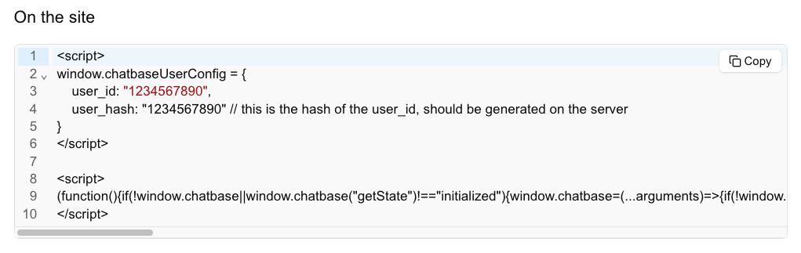

## Overview

Custom actions can run on both the server, or on the client. It would be beneficial to run a custom action client-side if the chatbot owner wants more flexibility with the action code, or wants to send an API request on behalf of the user, from the client side.

---

## How to Set Up Client-Side Custom Actions

1. **Embed the Chatbot using the new Script:**

To ensure that you can register client-side custom actions, you need to embed the Chatbase script correctly.

**Follow these steps to get the embed code:**

- Visit the **Chatbase Dashboard**.
- Navigate to **Connect** > **Embed** > **Embed code with identity**.
- Copy the embed code and add it to your application.

Here’s an example of the embed code you’ll find on the dashboard:



2. **Create the Client-Side Custom Action:**

To create a client-side custom action:

- Visit the **Chatbase Dashboard**
- Navigate to **Create custom action**
- Fill in the required fields, while choosing the type of the action to be client-side.

3. **Use the SDK `registerTools` method:**

   Load the Chatbase script and call the `registerTools` method with all the actions and include all the logic that will run when each action is called. The action names must match that written in the custom action page.

### Method Parameters

Each custom action method receives two parameters:

1. `args`: Contains all the arguments defined in your custom action configuration
2. `user`: Contains the authenticated user information if [identity verification](/developer-guides/identity-verification) is properly configured

```javascript
window.chatbase.registerTools({
  get_weather: async (args, user) => {
    // args contains parameters defined in your custom action
    // user contains authenticated user data if identity verification is set up
    try {
      const response = await fetch(
        `https://api.weatherapi.com/v1/current.json?q=${args.location}`
      );

      if (!response.ok) {
        throw new Error("Failed to fetch weather data.");
      }

      const data = await response.json();

      return { data, status: "success" };
    } catch (error) {
      // Return only the error message without any data
      return { status: "error", message: error.message };
    }
  },
});
```

### Response Format

Custom actions should return responses in the following format:

#### Success Response

When the action is successful, return both the `data` and `status`:

```javascript
//data should be either JSON or string

// Example with JSON data
{
  data: {
    temperature: 72,
    condition: "sunny",
    humidity: 45
  },
  status: "success"
}

// Example with string data
{
  data: "The weather in New York is currently 72°F and sunny",
  status: "success"
}
```

#### Error Response

When an error occurs, return only the `status` and error `message`:

```javascript
{
  status: "error",
  message: "Error message here"
}
```

---

## Important Notes

**Multiple Registrations:** Calling `registerTools` multiple times will override previous actions. Make sure to provide all desired actions in a single `registerTools` call.

**Environment Limitations:** Client-side custom actions will not work in the Chatbase Playground or Compare features, as these environments don't support client-side code execution.
