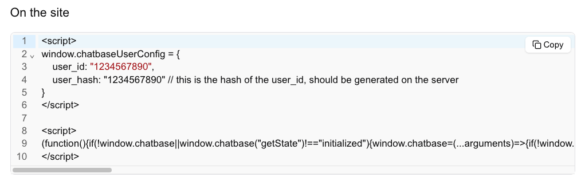

## Overview

Chatbase agents can be configured to verify the identity of your users. This is done by hashing the user's id with a secret key generated by Chatbase. The hashed value is then sent to us with custom action requests and is used to verify the user's identity.

---

## Obtaining the User hash

- The secret key is generated by Chatbase and is used to hash the user's id. The secret key is available in the Chatbase dashboard under chatbot settings > Embed > Embed code with identity.
- Use the secret key to generate the user hash on the server.

```javascript
const crypto = require("crypto");

const secret = "•••••••••"; // Your verification secret key
const userId = current_user.id; // A string UUID to identify your user

const hash = crypto.createHmac("sha256", secret).update(userId).digest("hex");
```

- Sent the user hash to Chatbase with the identify method.

## How to Enable Identity Verification

There are two ways to enable identity verification:

1. **Using the embed code:**

**Follow these steps to get the embed code:**

- Visit the **Chatbase Dashboard**.
- Navigate to **Connect** > **Embed** > **Embed code with identity**.
- Copy the embed code and add it to your application.

Here’s an example of the embed code you’ll find on the dashboard:



2. **Using the SDK `identify` method:**
   load the Chatbase script and call the `identify` method with the user's properties.

```javascript
window.chatbase("identify", {
  user_id: "1234567890",
  user_hash: "1234567890", // this is the hash of the user_id, should be generated on the server
});
```

## Allowed Properties

The `identify` method allows the following properties:

| **Property** | **Description**            |
| ------------ | -------------------------- |
| `user_id`    | The id of the user.        |
| `user_hash`  | The hash of the user's id. |

---

#### Mismatched User ID and User Hash

If the user id and user hash do not match, the user id will be removed from all custom actions api requests.

#### Calling `identify` multiple times

Calling `identify` multiple times will overwrite the previous properties.
