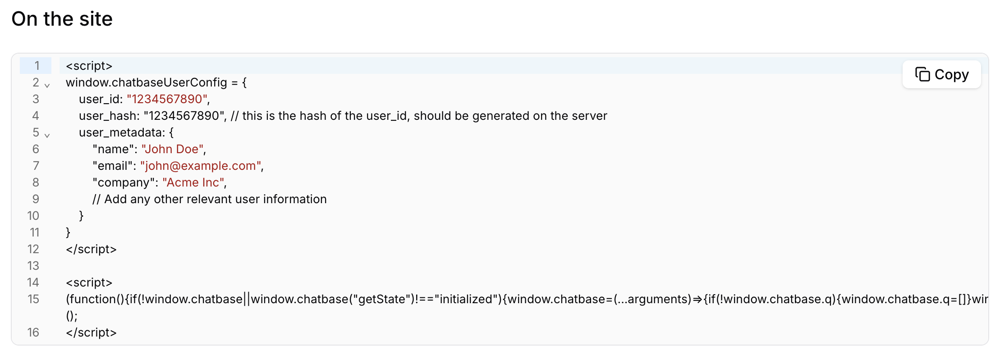

## Overview

Chatbase agents can be configured to verify the identity of your users. This is done by hashing the user's id with a secret key generated by Chatbase. The hashed value is then sent to us with custom action requests and is used to verify the user's identity. If the user and the hash do not match, the user id will be removed from all custom action requests. You
can also send additional metadata to the chatbot that can be used to personalize the chatbot experience. Metadata can't be used for custom action requests.

---

## Obtaining the User hash

- The secret key is generated by Chatbase and is used to hash the user's id. The secret key is available in the Chatbase dashboard under chatbot Connect > Embed > Embed code with identity.
- Use the secret key to generate the user hash on the server.

```javascript
const crypto = require("crypto");

const secret = "•••••••••"; // Your verification secret key
const userId = current_user.id; // A string UUID to identify your user

const hash = crypto.createHmac("sha256", secret).update(userId).digest("hex");
```

- Send the user hash and optional metadata to Chatbase with the identify method.

## How to Enable Identity Verification

There are two ways to enable identity verification:

1. **Using the embed code:**

Add this **before** the chatbase script.
```javascript
<script>
window.chatbaseUserConfig = {
    user_id: <USER_ID>,
    user_hash: <USER_HASH>, // this is the hash of the user_id, should be generated on the server
      user_metadata: {
        "name": "John Doe",
        "email": "john@example.com",
        "company": "Acme Inc",
        // Add any other relevant user information
      }
}
</script>
```

Here is an example of what the code should look like:



2. **Using the SDK `identify` method:**
   load the Chatbase script and call the `identify` method with the user's properties and optional metadata.

```javascript
window.chatbase("identify", {
  user_id: "1234567890",
  user_hash: "1234567890", // this is the hash of the user_id, should be generated on the server
  user_metadata: {
    "name": "John Doe",
    "email": "john@example.com",
    "company": "Acme Inc",
    // Add any other relevant user information
  }
});
```

## Allowed Properties

The `identify` method allows the following properties:

| **Property** | **Description**            |
| ------------ | -------------------------- |
| `user_id`    | The id of the user.        |
| `user_hash`  | The hash of the user's id. |
| `user_metadata`   | Optional object containing additional user information. This can include properties like name, email, company, or any other relevant data that you want to make available to your AI agent. **Maximum 1000 characters total for all metadata fields combined. Exceeding this limit will result in the metadata being truncated.** |


#### Mismatched User ID and User Hash

If the user id and user hash do not match, the user id will be removed from all custom actions api requests.

#### Calling `identify` multiple times

Calling `identify` multiple times will overwrite the previous properties.
