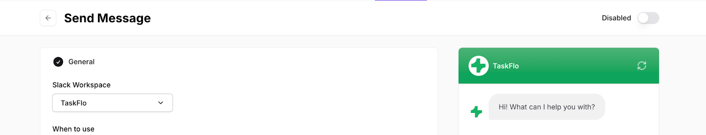

## Slack message sending

Enabling this action allows your dashboard to send a message to your Slack channel whenever the user mentions any topic that you want to be notified with. 

Check the steps to integrate Slack with Chatbase through this page.

1. Click on the **Create Action** button of Slack in the AI Actions menu:

2. Choose the Slack workspace that you want to be connected with this Action:

3. In the **When to use** section, provide a detailed description explaining when we should use this action. Include examples of the data this action provides and customer queries it helps answer. 

4. Click on Save button.

5. Make sure to enable this action to allow us to send a message to your Slack channel.

Now, you can try this action in the Playground on the right side of the page. It’s recommended to try sending a message in the Action preview to ensure that the chatbot sends a message to your Slack channel when the desired instructions are fulfilled before enabling the action.

Examples:

“Call this tool to send a message in slack to the channel named: ai-actions-slack whenever the user mentions any of the following topics: standard plan”

Once the user mentioned the standard plan, a Slack notification is sent to the channel connected to this action:

## Add Custom Button

The Custom Button action allows the chatbot to send a clickable button to the user when he asks about a specific topic. 

* Action name:&#x9;

This field is only showing the name of the action in the dashboard. 

* When to use:
  This is the area of instructions that should be provided as a detailed description explaining when the chatbot should use this action. It’s recommended to include examples of the data this action provides and customer queries it helps answer. 

* Button text:
  This is the text shown on the button provided to the users once asked about a specific topic. 

* URL:
  This is where to add the URL that the button should route the users to. 
 

After finishing the Custom Button configuration, you should click on the Save button. Then the action should be enabled from the top right corner in the page.

On the right side of the page, you can find the Playground area where you try the action before enabling it. It’s recommended to try sending a message in the Playground to ensure that the chatbot sends the button with the URL when the desired instructions are fulfilled before enabling the action.

Example:

“Provide the user a button when they ask about the pricing plans, the difference between any of Chatbase plans or the features available in each one. For example, when the user asks about the number of chatbots in the standard plan, you should let him know that the plan offers 5 chatbots and provide the button of the pricing page.”

## Create Custom Action

This action allows you to instruct the chatbot to provide any information that’s included in the response of the API you use.

* General

  * Action Name:
    This is a descriptive name for this action. This will help the chatbot know when to use it.

  * When to use:
    This is the area of instructions that should be provided as a detailed description explaining when the chatbot should use this action and API. It’s recommended to include examples of the data this action provides and customer queries it helps answer.

  * You should click on the Save and Continue button after completing the above configuration.

* API:

  * Collect data inputs from user:
    Here you should add the list of  information the chatbot needs from the user to perform the action. 

    * Name: Name of the data input.

    * Type: Type of the data input.

    * Description: A small sentence that describes to the chatbot the data input that it’s expecting to use in the API.

* API request:
  The API endpoint that should be called by the AI Agent to retrieve data or to send updates. You can include data inputs (variables) collected from the user in the URL or the request body.

  * Method: Choose the method that the API should use.

  * HTTPS URL: The URL of the API that the chatbot should use to retrieve the needed information.

  * Add variable: This button should be used when you want to add a variable that depends on the user’s input.

When the URL is added, the parameters, Headers and Body of the API should be added automatically.

* Parameters: These are key-value pairs sent as part of the API request URL to provide input data or filter the response.

* Headers: Metadata sent along with the API request to provide information about the request or client.

* Body: The data sent as part of the request, typically for GET, POST, PUT, DELETE methods. The common formats should include JSON. 

You should click on the Save and Continue button after completing the above configuration.

* Test Response: 

  * Live response: Test with live data from the API to make sure it is configured correctly.

  * Example response: Use example JSON data if the API is not ready.

  * You should click on the Save and Continue button after completing the above configuration.

* Data Access:

  * Full data access: Allow the chatbot to access all available information from the API’s response, ensuring comprehensive responses based on complete data.

  * Limited data access: Limit the information the AI agent can access, providing more controlled and specific replies while protecting sensitive data.

  * You should click on the Save and Continue button after completing the above configuration.

Example:

In this example, we use a Get Weather API to provide the weather information for the cities asked by the user to the chatbot. 

In the General section, we added Get\_Weather as a name of the action. We provided the When to use information for the chatbot to use this API whenever it’s asked about the weather of any city.

In the API section, we added the API used to retrieve the weather information. We added the name of the input as City, the type of the input is Text, and the description of the input as follows: The city that you want to know its weather.

In the API request section, we added the API URL (https://wttr.in/\{\{city}}?format=j1) and set the method as GET. The key value pair in the parameters is added automatically after entering the URL.

In the Test Response section, we tested the response of the API when we provided London as a city example. 

In the Data Access section, we choose the Full Data Access option for the chatbot to access all the information from the API response.

Now, we’re ready to ask the chatbot the weather of any city the user asks about in the Playground area on the left side of the page.

## Booking Appointments

It’s now possible for your customers to book appointments straight through the chatbot. All you have to do is to enable either one of our pre-built actions, Cal.com or Calendly.com.

## **Calendly**

In order to create this action, you would first need to integrate with your Calendly account.

After successfully connecting your Calendly account, you can head back to the actions page to configure your Calendly action. 

Make sure to select the Event that the bot can get the available slots from to be able to proceed.

### **When to use**

This is where you specify when exactly this action should be triggered or what type of customer queries would trigger it. You can also add in some instructions that the bot should adhere to when this action is triggered.

Examples:

“Call this action when the user mentions that he/she wants to book an appointment.”

“The window can only be 1 week long, if the user specified a longer period, use the same starting time, and the ending time should be 1 week later, responding to the user that the window cannot be longer than 1 week.”

## Cal.com

All you need to do to connect your Cal account is to add your Event URL under ‘Cal.com Event URL’. You **do not** need an integration for Cal.com.

### **When to use**

This is where you specify when exactly this action should be triggered or what type of customer queries would trigger it. You can also add in some instructions that the bot should adhere to when this action is triggered. 

Examples: 

“Call this action when the user mentions that he/she wants to book an appointment.”

“Check if the user booked an appointment or not from the tool result.” 

**Collect Leads**

Through the Collect Leads action, you will be able to customize when exactly does the ‘Lead’ form get triggered during the conversation that your customer is having with the bot.

**When to use:** In this field, you specify when exactly you would like for the form to show during the conversation. 

You can also specify other instructions related to the action, such as ‘DO NOT list the fields of the form’. Previewing the action will help you spot the edits you may like to make. 

Things to keep in mind when writing instructions:

* Make sure to use natural language.

* Keep the sentences short and simple. 

* Include examples that show the model what a good response looks like.

* Focus on what you’d like the bot to do rather than what to avoid. ​​Start your prompts with action-oriented verbs, e.g., generate, create, and provide.

*

**Success Message Title:** Customize the title of the message that gets displayed once the customer submits the form.

**Success Message Description:** Customize the message that gets displayed once the customer submits the form.

**Dismiss Message:** Customize the message that shows once the customer dismisses the form by clicking on the ‘X’ button.

You have the option to enable/disable any of the three available fields in the form (Name, E-mail and Phone Number). You also can set any of them (or all of them) to be a required field.

After you’re done editing, you can preview all your settings in the chatbot found on the Action page.

## Web Search

The Web Search action allows the AI Agent to browse the web for information and feed the results back to the AI Agent. 

When to use:

This is where you specify when exactly this action should be triggered or what type of customer queries would trigger it. You can also add in some instructions that the bot should adhere to when this action is triggered.

The web search action can be used as an additional source of information where the chatbot can get some information that isn't available in the sources. It’s recommended to add websites that are related to your business field. 

Include images

This allows the chatbot to provide images as replies to the users elaborating the answer provided.

Included domains

This option allows you to add specific domains that the chatbot can use to search the answer. If you didn’t add any domains, the chatbot will search over the whole web. 

## General Notes

* All actions can be previewed in the chatbox of the action itself.
* You need to enable the action after you’re done testing it so that it would reflect on your chatbot.
* Actions’ integrations are unique per chatbot so that you can connect different accounts to different chatbots’ actions, as you wish.
* Each action name needs to be unique per chatbot.
* The bot takes into account all the instructions specified when running any actions, including the ones you’ve specified in the prompt found in Settings.