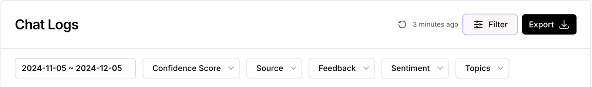

# Chats Logs

The chats log is divided into two parts:

1. The conversations list: It contains all the conversations done by the AI Agent.
2. The playground: It shows the messages of the conversation selected.

The chats log can be filtered by the following:

* Date
* Confidence score
* Source
* Feedback
* Sentiment
* Topic

In the Playground area, there are some actions that can be done:
* Revise answer: This feature allows you to modify the answer provided by the AI Agent if the answer wasn’t accurate enough.
  When you click on the Revise Answer button, it shows a form including the question asked by the user, the answer provided by the AI Agent and the Expected response that you add.

When the answer is updated, the question and the answer are added automatically to the Q\&A in the sources. 
* Confidence Score: It’s calculated based on how certain the AI Agent is about the answer given.
* You can check the low confidence score of the answers and revise them to be modified.

You can export the conversations in the chats log directly from the dashboard using the Export button. The export can be downloaded as JSON, PDF, and CSV.

# Leads

This section shows the answers done by the users to the lead form. The list shows the name, email and time of submission.

The leads form settings can be configured in the settings of the chatbot.