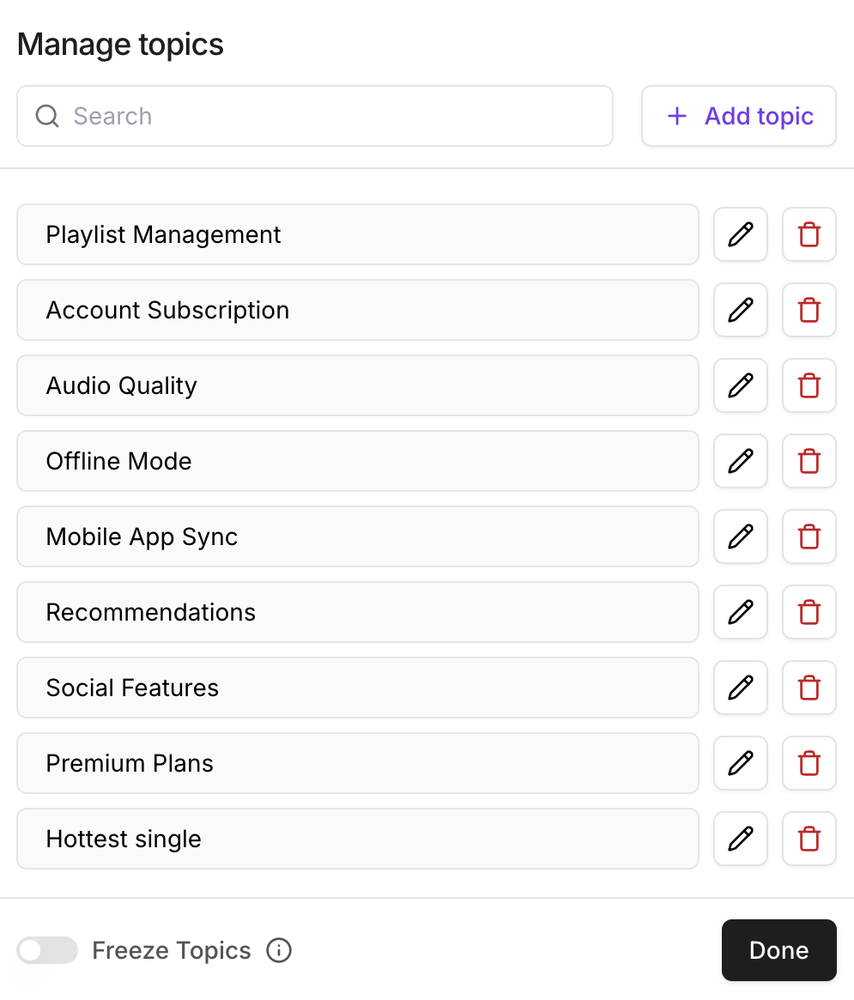

### Chats

This tab displays the Analytics and activity of the AI Agent during the conversations. The tab includes three sections: Chats, Topics and Sentiment.

By default, it shows the activity for all AI Agents  under your team for the last week.

It shows the total number of chats, total number of messages, the messages that had thumbs up from the users and the messages that had thumbs down.

The graph below shows the number of chats per country. The countries are detected from the IP of the users having conversations with the AI Agent.

You can always filter the data by date. There are pre-defined date filters such as last 7 days, last 30 days, last 3 months and last year.

### Topics

This section shows the topics that were included in the conversations and mentioned by the users.

Topics Actions:

* Search topics
* Add topic
* Edit topic
* Delete topic
* Freeze topics: Stopping the AI Agent to detect any topics automatically.

The topics are detected automatically by the AI Agent. However, you can add topics manually in the View All button in the the right of the page:

### Sentiment

This section shows how the AI Agent detects the sentiment and emotion of the users during the conversations. The sentiment analysis is detected automatically by the AI Agent.

### General Notes

* Analytics data is delayed by 1 day, as it updates at the previous day’s data.
* Data is stored once the user is on a specific subscription (Topics and Sentiment data will only be available since the user upgrades, any data for dates before upgrade will not be available).
* Data is shown per chat in Activity Tab for users too, and the aggregation is shown in Analytics Tab (topics, sentiment and thumbs down).
* Analytics can be shown as a Pie Chart or Graph.