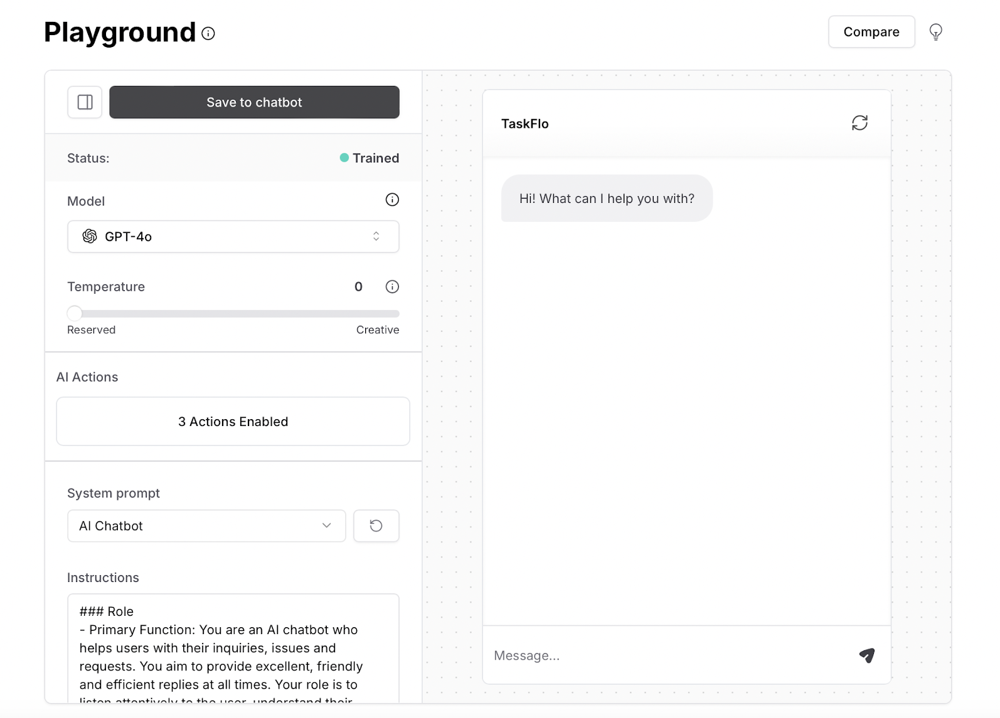
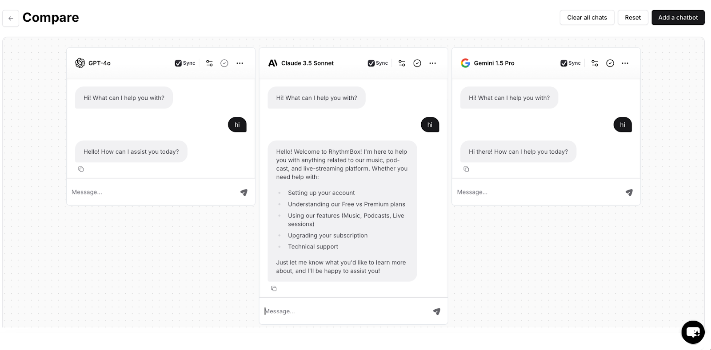
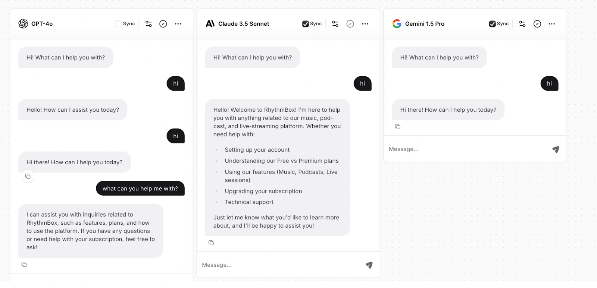
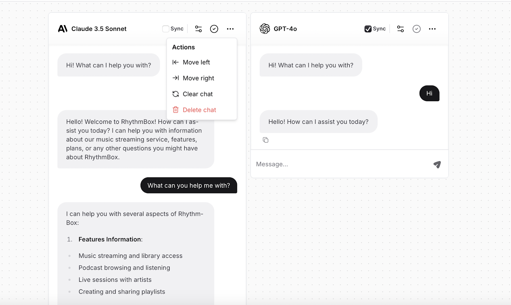
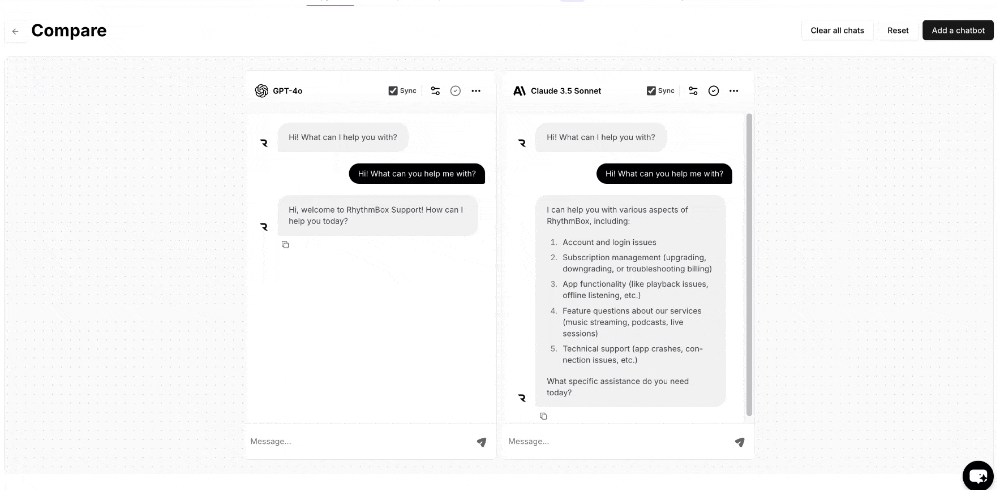

The Playground area is a space where you can interact with and test your AI agent. It allows you to see how it responds to different inputs and make adjustments as needed. This area is useful for refining the AI agent’s behavior and ensuring it meets your requirements before deploying it on your website or other platforms.

# AI Model

The AI model refers to the specific machine learning model used to generate responses for your AI agent. Chatbase supports a variety of AI models, including:

* GPT-4
* GPT-4 Turbo
* GPT-4o
* GPT-4o Mini
* Claude 3.5 Sonnet
* Claude 3 Opus
* Claude 3 Haiku
* Gemini 1.5 Pro
* Gemini 1.5 Flash

Each model has different capabilities, performance characteristics and message credits cost, allowing you to choose the one that best fits your needs.

# Side bar

### Temperature

It’s a setting that controls the "creativity" of your AI agent’s responses. It determines how random or deterministic the responses will be. A lower temperature (e.g., close to 0) makes the AI agent's responses more focused and consistent, choosing the most likely output. A higher temperature results in more varied and creative responses, which can be less predictable.

By default, the temperature is set to zero, but you can adjust this setting to experiment with different response styles and find the one that best suits your needs.

### AI Actions

Your AI agent can now take actions on behalf of your customers through our AI actions feature. For more detailed information, please check out [this guide](/user-guides/chatbot/actions).
### System Prompt

Helps define the AI agent’s behavior and personality. It sets the context for how the AI should interact with users by providing initial instructions or guidelines. This can include specifying the AI agent’'s role, tone, and any specific instructions on how to handle certain types of queries. By customizing the system prompt, you can align the chatbot's responses with your brand's voice and ensure it behaves in a way that meets your business needs. 

### Best Practices

* Make sure to use natural language.
* Keep the sentences short and simple. 
* Include examples that show the model what a good response looks like.
* Focus on what you’d like the bot to do rather than what to avoid. ​​Start your prompts with action-oriented verbs, e.g., generate, create, and provide.

# Compare Area

The “Compare” area allows you to add different AI agents next to each other and assign different settings to each to make testing and figuring out the settings that best suit your needs easier! 

The same message will be sent to all chats so that you can test the AI agent’s response to the same message under different settings.

 You can also configure the below settings (buttons explained from left to right):

1. You can untick the ‘Sync’ button if you don’t want the message sent to this AI agent to reflect on the rest of chats.

2. Adjust the settings for this specific AI agent (AI model, temperature, prompt).

3. Save the settings you’ve assigned to the AI agent to the main AI agent’s settings.

4. From the three dots, you can move the position of the chatbot either to the left or right, reset the chat, or to delete the chat box completely.

You can also use any of the following options:

* Clear all chats. 
* Reset the settings of the AI agent to the main settings. 
* Add a new AI agent to test with.

