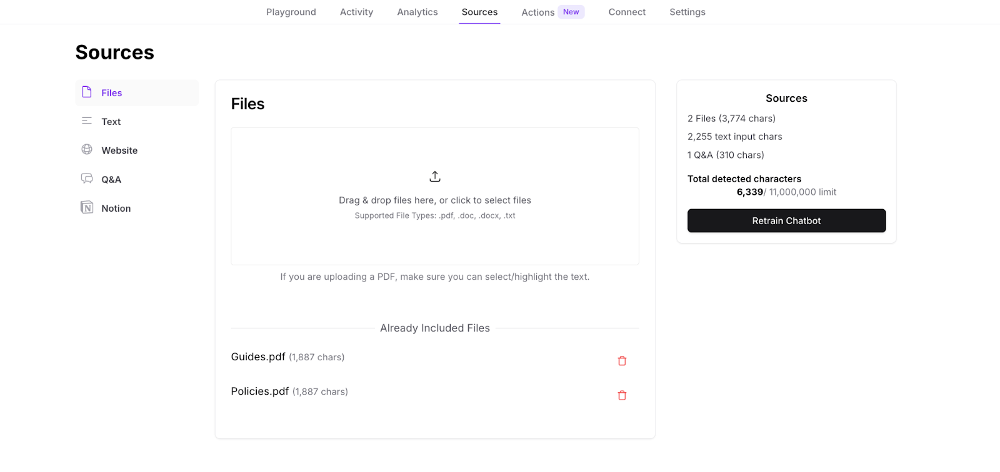
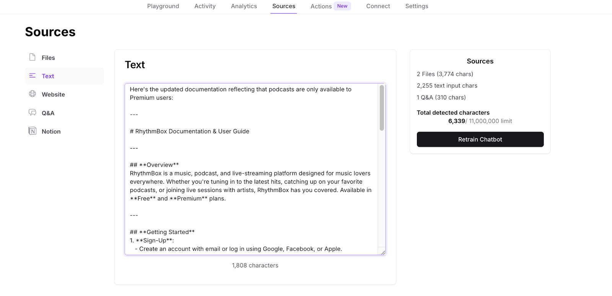
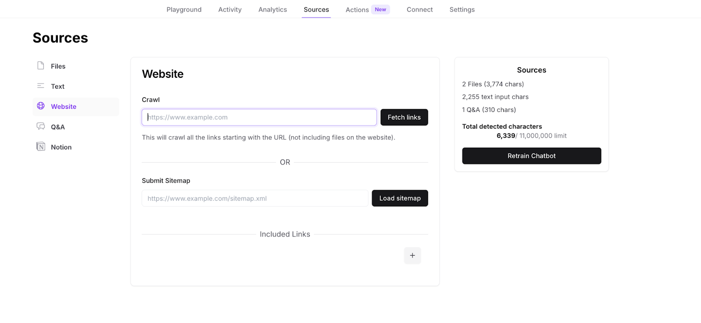
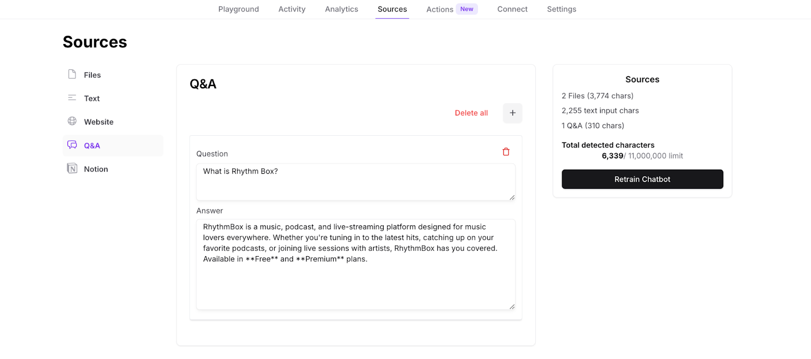
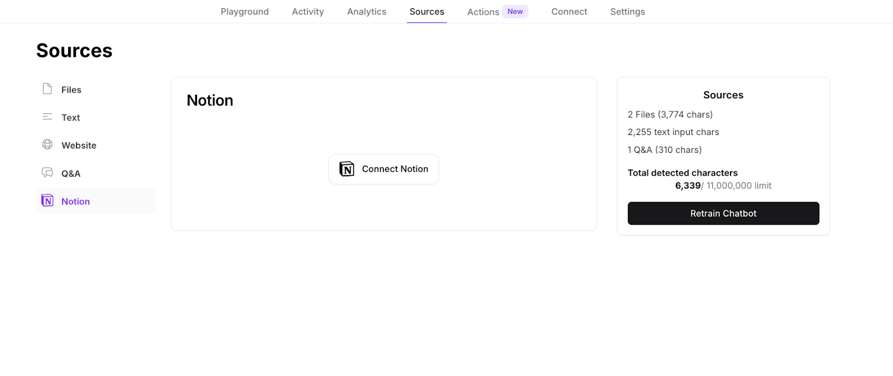

In Chatbase, "sources" refer to the data that you provide to train your chatbot. These sources can include:

1. Documents: You can upload documents that are in the following formats: .pdf, .txt, .doc, or .docx.

2. Text: You can paste text from your clipboard directly into the platform.

3. Links: You can add a link/submit sitemap to your website, and Chatbase will extract the data from it. Only text is extracted from your pages, any other form of data is ignored.

4. Q\&As: you can manually provide specific questions and their corresponding answers for your AI agent to use. Revised answers from the 'Activity' tab are also saved as Q\&As.

5. Notion Integration: This integration enables your AI agent to access and utilize information stored in your Notion databases. 

### General Notes

* Each AI agent cannot be trained on more than 11 million characters.
* When uploading PDFs, make sure text is selectable. 
* All data should be in plain text, using mark-down language is preferred. 
* When integrating with a Notion account that's on a paid plan, make sure you have admin access to provide all necessary permissions for the integration to be successful.
* Make sure to press on the "Retrain Chatbot" button after you're done adding/updating your sources.