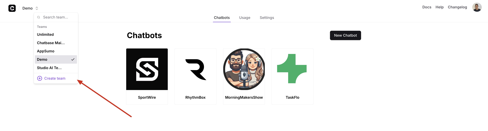
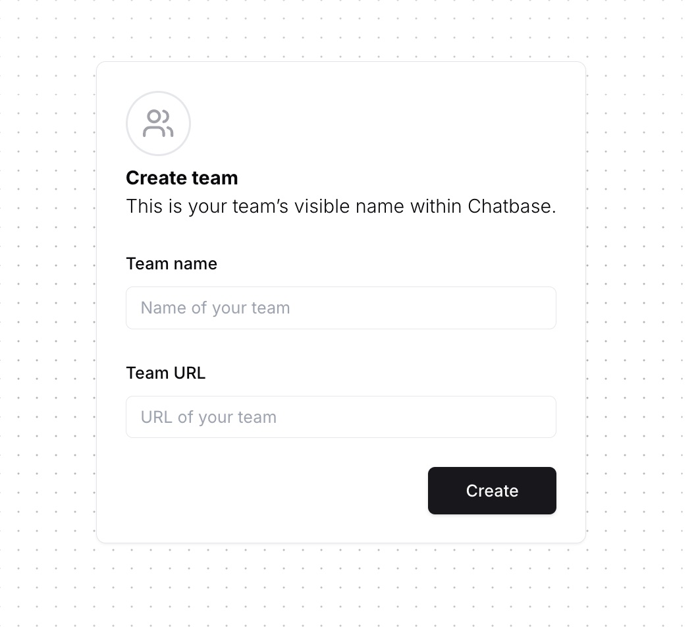
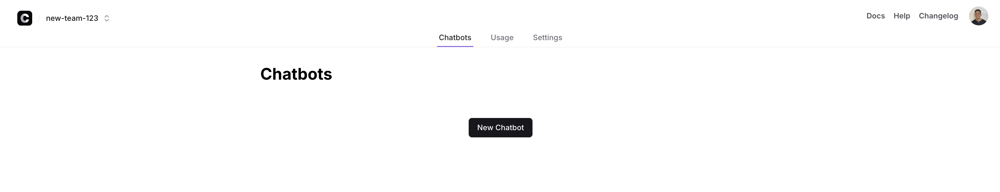

# Creating a Team

To create a new team, click on the **Create Team** button on the **Select team** dropdown menu.

On the next page, you need to add the details for the team, which includes:

* **Team Name:** Defines the bot's display name within the dashboard.  
* **Team URL:** Specifies the team slug, visible only in the URL when accessing the team on the dashboard.

***Important Note:*** You can choose any team URL you prefer, as long as it’s unique and doesn’t match with any existing team.

After creating the team, you will be taken to a new page where you can press 'New Chatbot' and start adding your sources to start your Chatbase journey!

# General Notes

* **Each team** has its own chatbots, billing information, and plan. These are not shared between teams.

* **Owners** can change team settings (billing, plan, name), delete the team, and manage all chatbots within the team.

* **Members** can only manage chatbots (train them, see data, delete them). They cannot change team settings.

* **Invite links** expire 24 hours after it has been sent to an invitee.