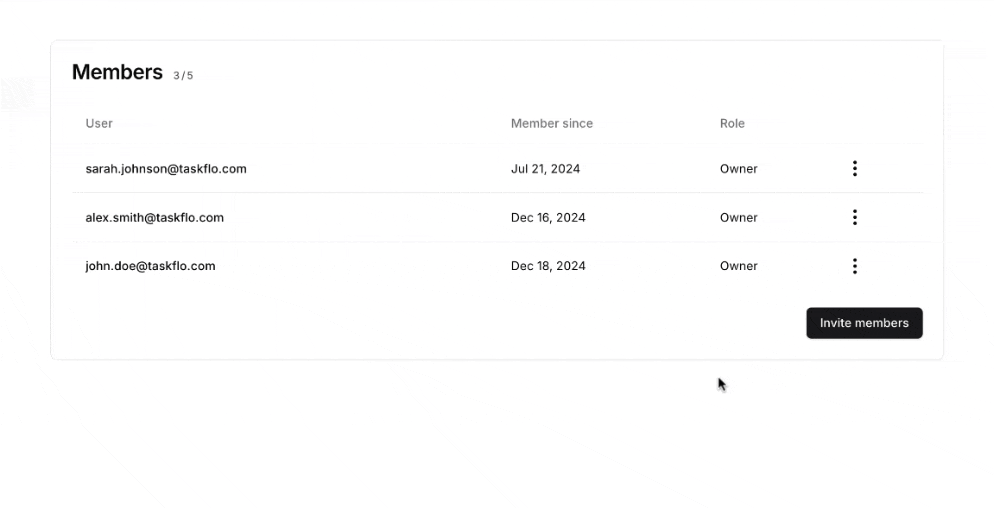

# General

This tab provides general information about the bot, including the Team Name and Team URL. The Team Name is displayed on the dashboard and in the chatbot path, while the Team URL appears in the address bar when accessing the team or its bots.

To modify the name or URL, simply edit the text in the field and click "Save."

You can also delete the entire team and all its chatbots by clicking the "Delete" button at the bottom of the page.

# Members

This tab displays all the information about your team members, as well as those you've invited but haven't responded yet.

### Number of members

This shows the number of team members and invited members. In this example, the user has 3 members and invitations, with a maximum limit of 5.

### Modify team member role

To modify a team member's role or remove them, click the three dots next to their name.

* **Owners**: Can change billing information, modify plans, rename or delete the team, and manage all chatbots within the team.
* **Members**: Can update training data, view analytics, and delete chatbots. They cannot alter team settings.

### Remove team member

To remove a member from the team

### Modify Invitations

You can resend the invitation if it expired after 24 hours or if the invitee didn't see it in their inbox. You can also revoke the invitation to cancel it and prevent the invitee from joining the team.

### Invite Members

You can use this button to send new invitations to your team from the dashboard. To invite multiple members at once, click "Add Member."

***Note :*** If the button is unclickable, it means you've reached the maximum number of members or invitations. Clear some space to be able to invite new members.

# Plans

This tab shows you information about all the currently available plans, and allows you to make changes to your plan, or add new add-ons.

### Available Plans

This section displays all available plans for subscription. You can switch between monthly and yearly  by toggling the option. It's important to note that subscribing annually lets you pay for 10 months instead of 12.

If you choose to downgrade to a lower plan, such as from Unlimited to Hobby, the downgrade will take effect immediately. You'll receive a prorated credit based on the remaining time on your current plan, which will be applied to your new plan and any future invoices until the credit is used up.

Clicking "Cancel Plan" under your active plan disables auto-renewal. Your current plan will remain active until the next renewal date, after which you'll be downgraded to the free plan to avoid further charges.

***Note :*** Legacy plan users may not see the "Cancel Plan" button, as their active plan won't be listed. To downgrade to the free plan, please contact [support@chatbase.co](mailto:support@chatbase.co).

### Add Ons 

This section is responsible for adding extra stuff on top of your current plan. Some add-ons are one buy for the whole team like custom domains or remove powered by chatbase. So by clicking enable you will see a prompt similar to this one:

If you are choosing an add-on that can have quantities like extra chatbots, or extra message credits, you will see a prompt similar to this:

# Billing

This page provides all the information related to , including your current plan, usage,  details, and history

### Subscription Details

This section displays details about your current plan, including all the features and limits. It also includes a subsection for your active add-ons and their costs.

You can click “Manage Subscriptions” to be taken to the pricing tab, where you can make any necessary changes.

### Usage
This section provides details on your message credit usage and limits.

***Note :*** The “Next Renewal” date refers to when you’ll receive a new set of message credits, not your next payment date.

### Billing Details

This section displays your billing information, this information will appear on your invoices. You can edit it as needed and click “Save” to update the details.

### Billing Email

This section shows the email address that will receive automated copies of all invoices for this team.

### Tax ID

In this section, you can add a tax ID to be displayed on the invoice if needed.

### Billing Method

In this section, you can add payment methods and set one as your default. You can also delete payment methods, provided they are not set as the default.

### Billing History

In this section, you can view all your past invoices along with their statuses. Click on an invoice to view it, and you’ll also have the option to download it.

# API Keys

On this page, you’ll find your Chatbase API keys, which allow you to interact with your bot using API calls.

***Note :*** This page is not available on all plans. If your plan doesn’t include API access, you won’t be able to view this page.

# OpenAI Key

You can add an external OpenAI API Key here. It will be used when your monthly message credits run out.

