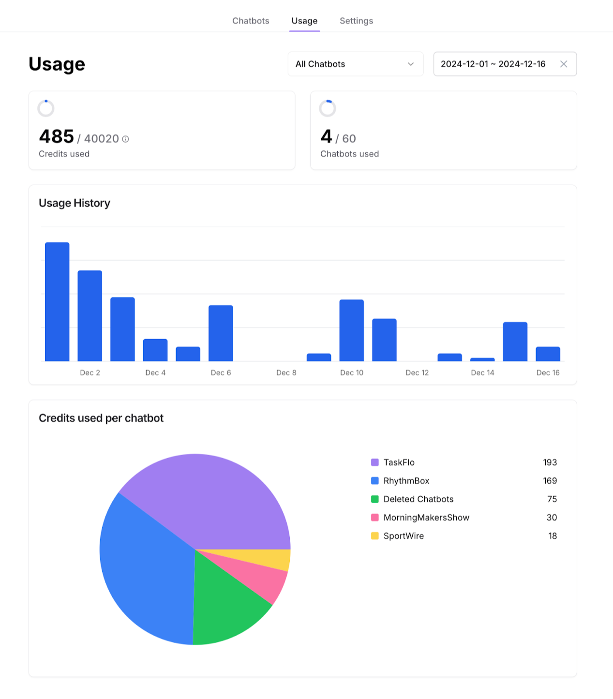
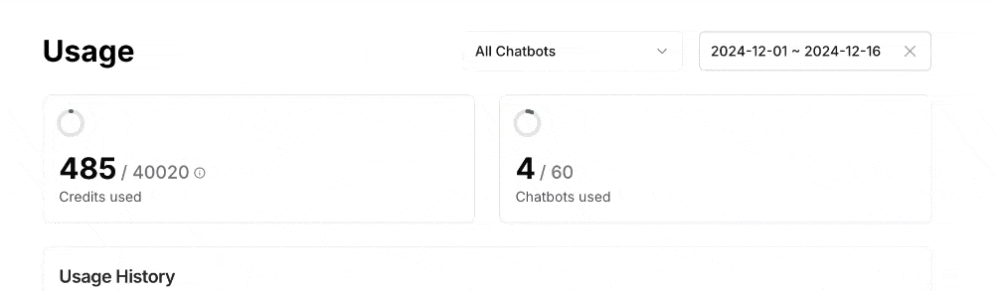
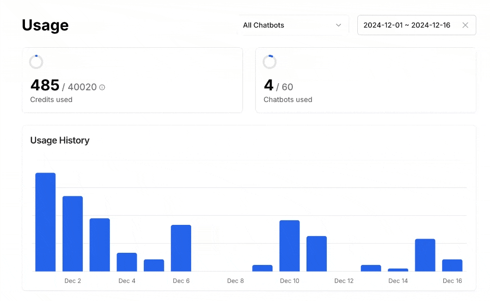
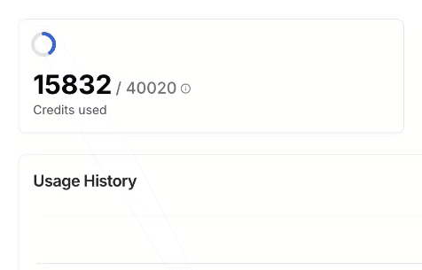
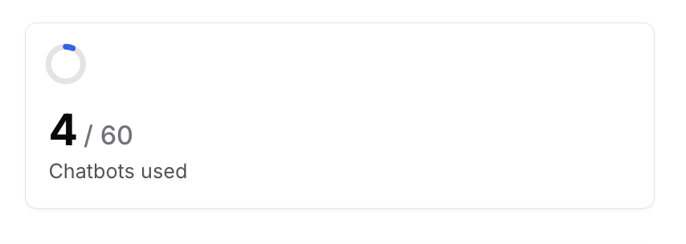
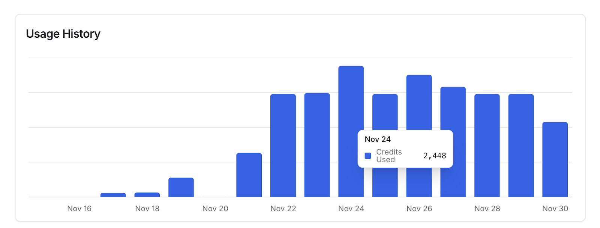
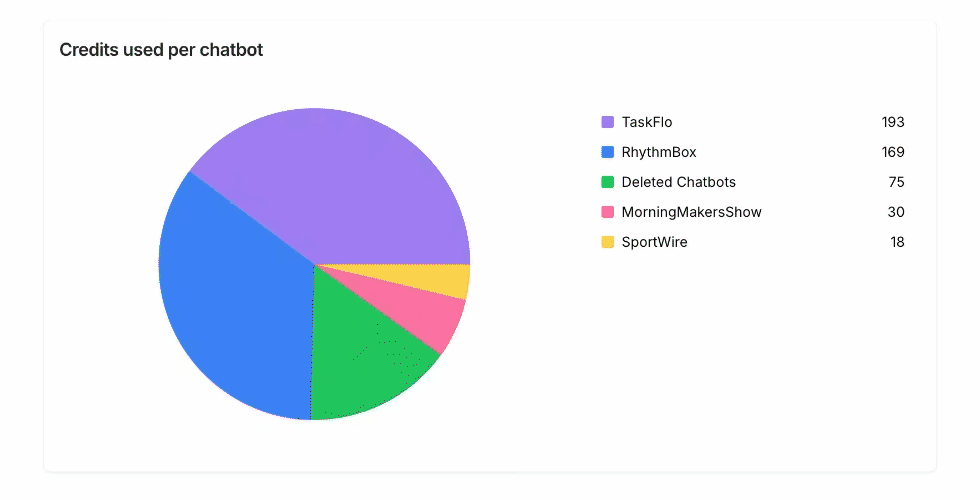

By default, it shows the usage for all bots under your team for the current month.

## Configuration

### Chatbots

You can view usage for all your bots, a specific bot, or deleted bots to check the credits used by removed bots. 

To switch between chatbots:

### Time Interval

You can configure the time interval to view usage for a specific period, such as last week. The selected time interval is highlighted in blue, as shown below.

To adjust the time interval:

## Usage Summary

This section shows a summary for credits used and the number of chatbots used within the time interval you specified.

### Credits Used

The section displays the number of message credits used. You can hover over the tooltip to see a detailed breakdown of the credits consumed.

### Chatbots Used

This section shows the number of chatbots in use compared to the total allowed. For example, this team has 4 chatbots out of a maximum of 60.

## Usage History

The usage history displays the number of message credits used per day for the selected time interval. Hover over a specific histogram to see the exact credits used on that day.

### Credits used per chatbot

This section compares credit usage across chatbots for the selected time interval. 

Hover over any color in the pie chart to see the exact number of credits used by the chatbot assigned to that color.

